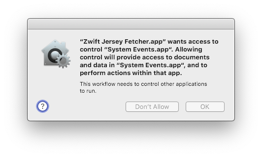
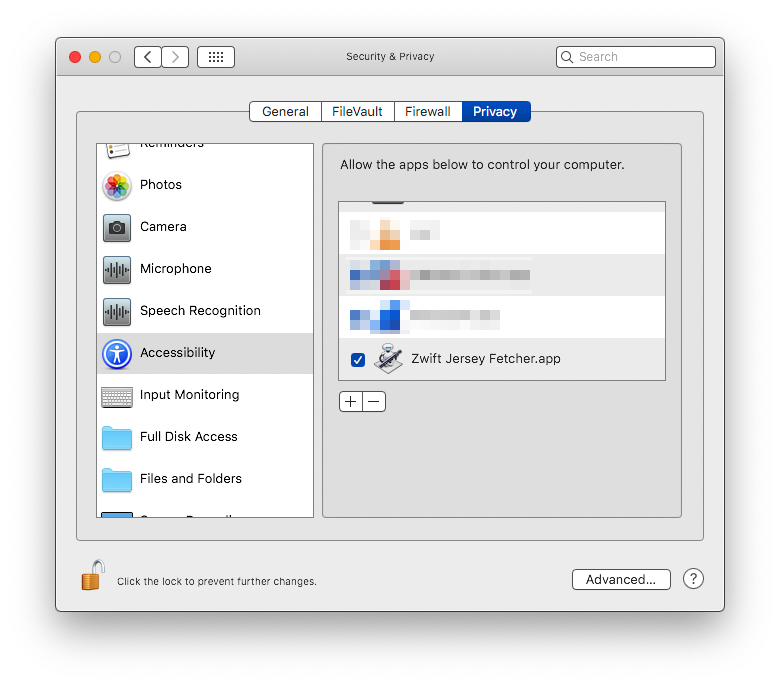
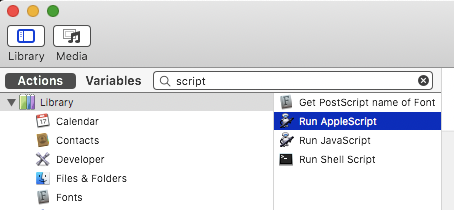
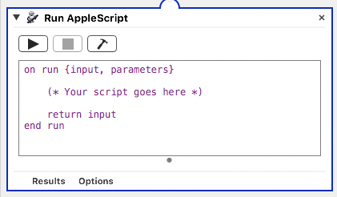
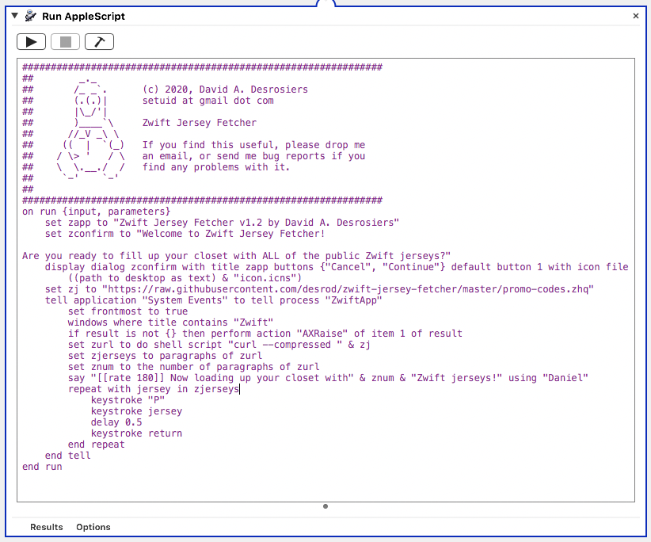

## Running the Zwift Jersey Fetcher in Automator on macOS ##  

There are two methods of running this on macOS, and both are very easy. Keep in mind that both methods described below require that Zwift be _launched and running_ when you execute this:

### Running the "Zwift Jersey Fetcher.app" directly
---
Copy the .app and .icns files in this directory to your Desktop. These _must_ run from your Desktop, not another directory. Because Automator on macOS doesn't permit embedding dialog box icons within the .app itself, it looks in a hard-coded path, in this case, your desktop, the icon.icns file must exist on your desktop. You can change this path in the code if you want (see method 2 below for how and where to change this). 

If the icon.icns is not on your ~/Desktop/, you'll get an error that looks like this.

Next, we need to go to System Preferences → Security & Privacy → Privacy tab → Accessibility. 

Click the lock in the lower-left corner to allow you to changes here, and then click the [+] sign on the right under "Allow the apps below to control your computer", and add the 'Zwift Jersey Fetcher.app' file here. 

The reason this step is needed, is becacuse the "System Events" process on macOS is what will be sending the actual keystrokes (jersey codes) into the Zwift app itself. This is needed to allow "System Events" to control the "Zwift" app. When one app needsd to control or talk to another app directly, it has to be authorized to do so. 

If you don't do this step, you'll get an error that looks like this: 
    

    
If you added the Zwift Jersey Fetcher app correctly under Accessibility, it should look like the following: 
    

Now launch Zwift and log in. You don't have to proceed any further than the initial "Pairing" screen where you choose your devices, as long as you're logged into the UI, that's sufficient. 

If you want to continue paring your devices and go all the way to the road where you're visible on your bike/running gear, that's fine too.

Go back to your desktop and double-click the 'Zwift Jersey Fetcher.app' file, or right-click on the .app and chooose Open. You'll get a brief confirmation dialog to be _absolutely sure_ you want to run this, and then it will proceed. 

If you choose to proceed, it will then push all of the known, public jersey codes into your profile and fill up your closet. 

### Running the automator script from source
---
If you want to run the script from source directly in Automator, you can do that as well, and I strongly suggest you inspect the source before running any unknown code you download from the Internet, including mine. 

To do that, simply clone this repository with your Git client of choice, or cut-and-paste the source code from the .automator file found in this directory to your clipboard. 

Launch "Automator" on your Mac, and choose File → New. When the dialog pops up, double-click on "Application": 

On the next screen, you're going to start typing 'script' into the search box, as shown here: 

Select "Run AppleScript" and double-click that. That will open a new pane to the right, with a generic boilerplate AppleScript already populated. You're going to select all of this and delete it. 

We're going to replace that entire bit of sample code with the contents of 'zwift-jersey-fetcher.automator' found in this directory. It should look something like this, when you've done it correctly: 

Now all that is needed, is to make sure you're logged into Zwift before running this, then click the little [>] play button at the top-left of the script window, or the one at the top-right corner of the Automator window. 

From here, the process is the same as the previous method used launching the .app itself. 

## Errata about Jersey Codes
---

The list of jerseys is evolving as we find new jersey codes, so you'll be able to re-run this when new codes are found, and stuff in additional codes. 

Unfortunately, there's no easy way to tell which jerseys you may already have, so it will just go through the full list each time. For jerseys you already have, they'll be ignored, and only new jerseys will be added. 

If you have any questions or issues, please file an Issue against this project on Github and I'll address it right away. 

Good luck! 

